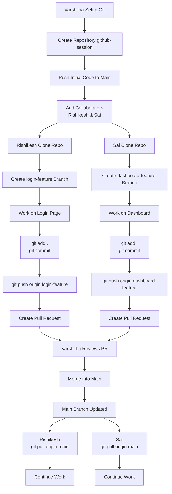

# GitHub Session Workflow

```mermaid
flowchart TD

    A[Varshitha Setup Git]
    B[Create Repository github-session]
    C[Push Initial Code to Main]
    D[Add Collaborators<br/>Rishikesh & Sai]

    A --> B
    B --> C
    C --> D

    D --> E[Rishikesh Clone Repo]
    D --> F[Sai Clone Repo]

    E --> G[Create login-feature Branch]
    F --> H[Create dashboard-feature Branch]

    G --> I[Work on Login Page]
    H --> J[Work on Dashboard]

    I --> K[git add .<br/>git commit]
    J --> L[git add .<br/>git commit]

    K --> M[git push origin login-feature]
    L --> N[git push origin dashboard-feature]

    M --> O[Create Pull Request]
    N --> P[Create Pull Request]

    O --> Q[Varshitha Reviews PR]
    P --> Q

    Q --> R[Merge into Main]

    R --> S[Main Branch Updated]

    S --> T[Rishikesh<br/>git pull origin main]
    S --> U[Sai<br/>git pull origin main]

    T --> V[Continue Work]
    U --> W[Continue Work]

```